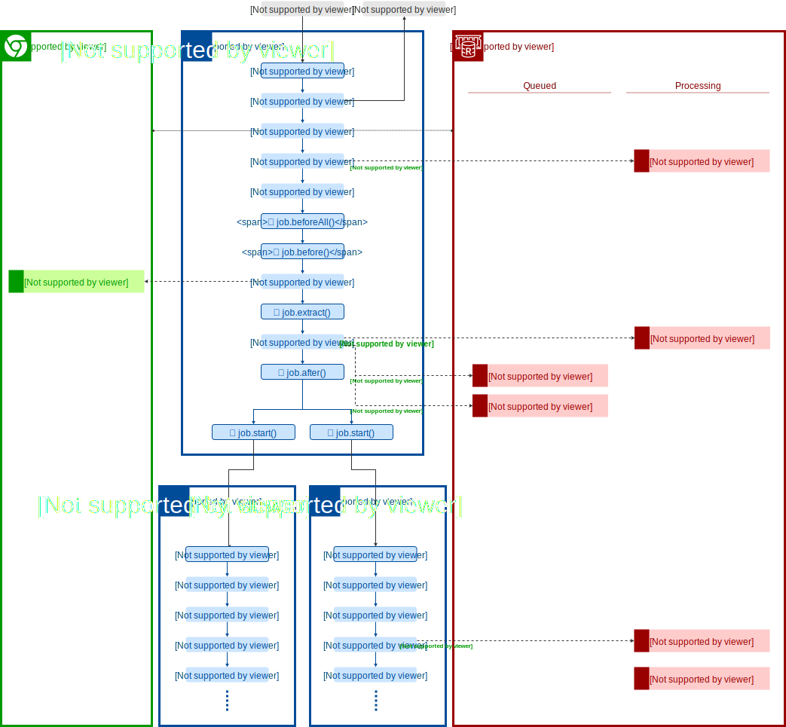

## Services

Locust depends on Redis for managing the job queue and Chrome to execute HTTP requests via Puppeteer.

The suggested setup for the these services is below.

### Local

In a local setup (e.g. `locust-cli`), it is simplest to run services with Docker Compose and Locust jobs within one or more system processes.

### Cloud

Locust is not limited to running on any one cloud service provider however the selected provider must have a service for serverless functions, hosted Redis or equivalent, and Docker container hosting.

## Persistence

Locust has no persistence capabilities built in. Developers are free to choose any persistence layer they see fit. One use case of the `after` hook is to persist collected data to a store.

:::warning Note
It is not reccomended to use Locust's Redis to store the output of jobs since it may interfere with the internal operation of Locust.
:::

## Process
