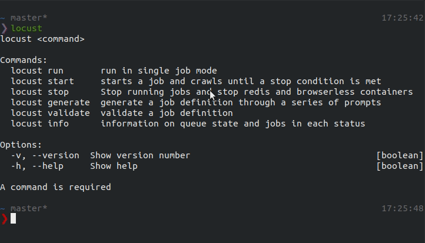
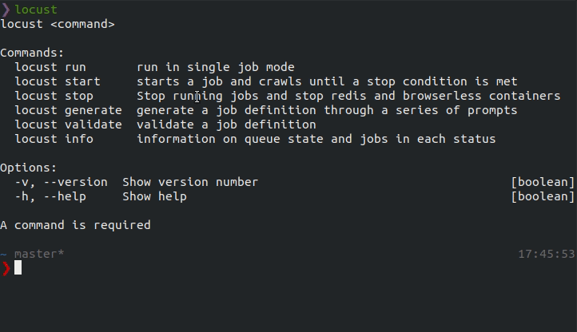
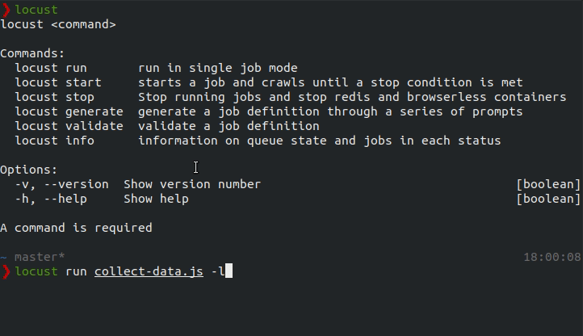
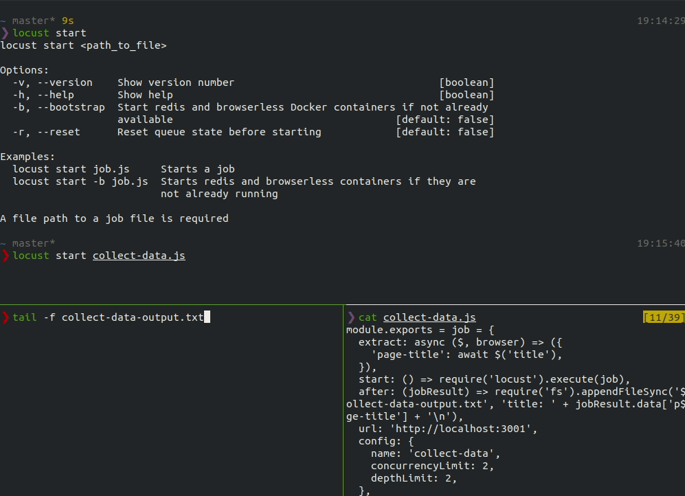

Locust can be run locally but it truely shines when run on a serverless provider. When trying out or developing Locust jobs, it is simpler to run Locust locally to avoid extraneous issues related to cloud providers. In this guide, we'll get up and running locally with Locust.

## Create a job

The locust-cli provides a generator that steps through creating the basic components of a job:
```sh
locust generate
```

<details>
<summary>Example prompt</summary>

</details>

For more in depth explaination what can be configured in a job, check the [API docs](api).

## Validate the job

Before running the job, validate that that is conforms to [the spec](api):
```sh
locust validate collect-data.js
```
<details>
<summary>Example output</summary>

</details>

## Test the job

First try running the job in limited-mode to confirm that any data or link extraction is working as expected. While running in limited-mode, Locust will only run against the entrypoint url.

```sh
locust run collect-data.js -l
```

In the above response, any fields defined in the `extract` function and and links one the page should be included which confirms that the job works as expected.

:::important Note
Lifecycle hooks, queue configuration, and connection configuration are ignored in [limited-mode](cli#limited-mode)
:::

## Run the job

### Setup

In order to run Locust in standard-mode, a Redis and Chrome instance must be running. The easiest way to start these is with the CLI.

:::important Note
[Docker](https://docs.docker.com/install/overview/) and [Docker Compose](https://docs.docker.com/compose/install/) must be installed before running this command.
:::

```sh
locust start -b
```
<details>
<summary>Example output</summary>

</details>

This is a shortcut to start a [Docker Compose file](https://github.com/achannarasappa/locust-cli/blob/master/lib/start/docker-compose.yml). Alternately, the [redis](https://hub.docker.com/_/redis) and [chrome](https://hub.docker.com/r/browserless/chrome) containers can be started with ad-hoc commands.

### Persistence

The CLI will save results to a timestamped JSON file (e.g. `results-2019-06-29-20-50-22.json`) after a run for debug purposes.

<details>
<summary>Example output</summary>
```js
[
  {
    "data": {
      "title": "home"
    },
    "links": [
      "http://localhost:3001/vibrant_margulis",
      "http://localhost:3001/silly_leakey",
      "http://localhost:3001/sleepy_johnson",
      "http://localhost:3001/unruffled_sanderson",
      "http://localhost:3001/elated_sanderson"
    ],
    "url": "http://localhost:3001/"
  }
]
```
</details>

When running outside the CLI, `locust` does persist any data. In order to retain data collected during a run, an `after` hook can be added to the job file:

```js
...
after: (jobResult) => client.query('INSERT INTO products(name, photo_url) VALUES ($1, $2)'),
...
```

### Run

Now that the job been proven to work on a single page, run the job in [standard-mode](cli#standard-mode) to confirm lifecycle hooks and queue configuration work as expected.

```sh
locust start collect-data.js
```

<details>
<summary>Example output</summary>


When the start command is run, the dashboard shows the overall status, the number of jobs in each status, the status of the queue, and a running list of jobs.
</details>

:::important Note
The `start` lifecycle hook is ignored when running with the cli in either standard-mode or limited-mode.
:::

## Reference
- [locust](https://github.com/achannarasappa/locust)
- [locust-cli](https://github.com/achannarasappa/locust-cli)
- [Puppeteer API docs](https://github.com/GoogleChrome/puppeteer/blob/master/docs/api.md)
  - [$ (query selector)](https://github.com/GoogleChrome/puppeteer/blob/master/docs/api.md#pageselector)