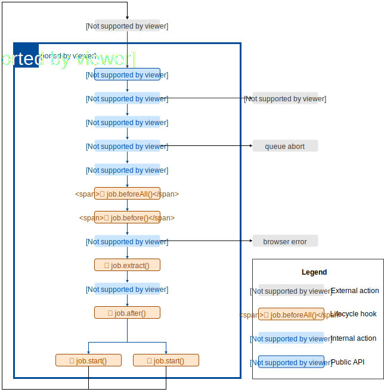

## execute
Starts the execution of a job starting with the `url` in the job definition or picks up a new job from the queue.

## validate

Validates the job definition. See [API docs](#) for what constitutes a valid definition.

## queue.register

Registers the job with the Redis queue. Behaviour will differ based on whether it is the first run of this job.

### first run

On first run of a new job, `queue.register` will add a single job to the Redis `processing` list with the `url` defined in the job definition and process that job.

### subsequent runs

On all subsequent runs, `queue.register` will pop the next job from the Redis `queued` list. If the depth limit has been execeeded, the concurrency limit has been met, or another stop condition has been triggered, the execution will abort.

## job.beforeAll

Executes a user defined hook that runs once before the first request is made on the first run.

This hook can be used to handle authentication flows and get crendentials for the first and subsequent job runs.

## job.before

Executes a user defined hook that runs before each request is made.

This hook can be used to set user credentials prior to making the request.

## request

Using the connection to the Chrome browser defined in the job defintion, a request is executed to the url for the current job.

Links are also extracted from the page which will eventually added to the queue.

## job.extract

Executes a user defined hook that runs as part of the request made to the url.

This hook can be used to extract data from the page.

## queue.deregister

Moves the current job to the `done` Redis list and adds the links extracted from the page to the queue.

## job.after

Executes a user defined hook that runs after the request completes.

This hook can be used to process the data from the request and/or persist data to datastore.

## job.start

Starts additional job runs up to the concurrency limit by calling the `start` user defined hook which is used to define how new jobs are started.

In a serverless context, the `start` function might invoke a new instance of the serverless function.

In a local, non-distributed context, the `start` function might start a new system process where a job would run.